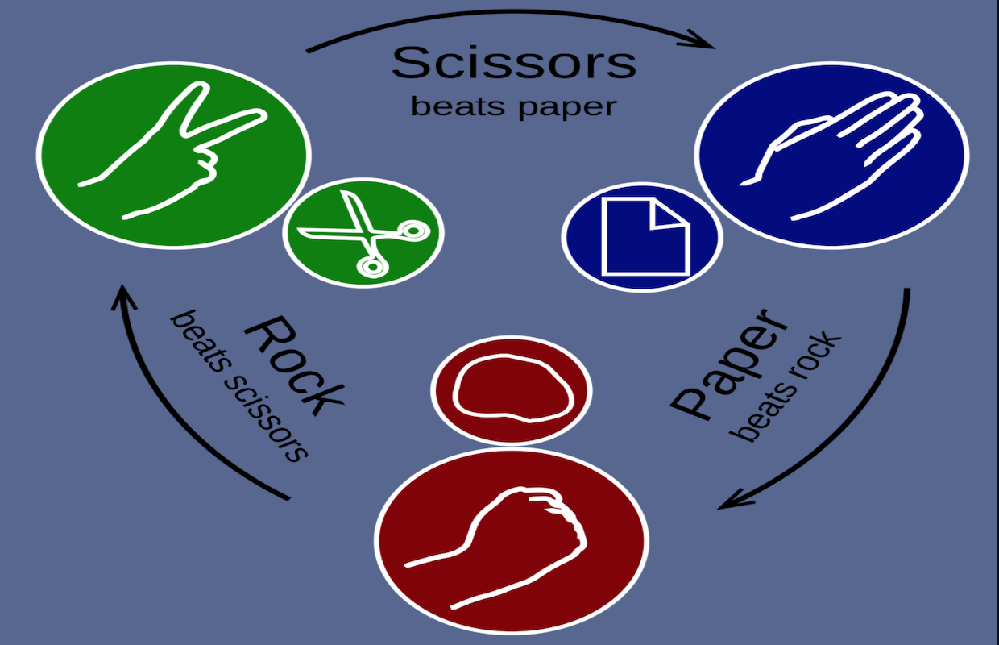

<!-- AUTOMATION BADGES -->

[](https://github.com/webceyhan/rock-paper-scissors-game/actions/workflows/codeql-analysis.yml)
[](https://github.com/webceyhan/rock-paper-scissors-game/actions/workflows/build-and-deploy.yml)

<!-- HEADER ///////////////////////////////////////////////////////////// -->

# Rock Paper Scissors Game

This is a single-play implementation of the famous Rock-Paper-Scissors game.

The application is built with Vite + Vue 3 + Bootstrap and written in TypeScript.
There is no need for backend server as it only works in single-play mode against the computer.

[View Demo](https://ceyhan.io/rock-paper-scissors-game/) |
[Report Issue](https://github.com/webceyhan/rock-paper-scissors-game/issues) |
[Request Feature](https://github.com/webceyhan/rock-paper-scissors-game/pulls) |
[@webceyhan](https://twitter.com/webceyhan)

<br>
<!-- REQUIREMENTS /////////////////////////////////////////////////////// -->

## Requirements

You need to install the [Node.js](https://nodejs.dev/) and `npm` package manager first.

> Recommended IDE:
> [VSCode](https://code.visualstudio.com/) + [Volar](https://marketplace.visualstudio.com/items?itemName=johnsoncodehk.volar)

<br>
<!-- INSTALLATION //////////////////////////////////////////////////////// -->

## Installation

1. Clone the repository.
    ```sh
    git clone https://github.com/webceyhan/rock-paper-scissors-game.git
    ```
2. Get inside the cloned project folder.
    ```sh
    cd rock-paper-scissors-game
    ```
3. Install NPM packages.
    ```sh
    npm install
    ```

<br>
<!-- USAGE /////////////////////////////////////////////////////////////// -->

## Usage

You can use following commands to do various task with the project.

```sh
npm run dev             # start development server
npm run build           # build for production
npm run preview         # preview built application
```

> Take a look at the other scripts in [`package.json`](./package.json)

<br>

### Game Rules



<br>
<!-- DEVELOPMENT ///////////////////////////////////////////////////////// -->

## Development

Start the development server to watch changes while you code.

```sh
npm run dev
```

<br>
<!-- BUILDING //////////////////////////////////////////////////////////// -->

## Building

Build the application for production.

```sh
npm run build
```

You can also preview the application after building it.

```sh
npm run preview
```

<br>
<!-- DEPLOYMENT ////////////////////////////////////////////////////////// -->

## Deployment (GitHub Pages)

A GitHub Action will automatically deploy the project to GitHub Pages on every push.

The workflow will build the project using npm and output the result to the `dist` folder which will be then pushed to the `gh-pages` branch.

> See the details in [.github/workflows/build-and-deploy.yml](./.github/workflows/build-and-deploy.yml)

<br>
<!-- REFERENCES ////////////////////////////////////////////////////////// -->

## References

-   [Node.js](https://nodejs.dev/)
-   [Vite](https://vitejs.dev/)
-   [Vue.js](https://vuejs.org/)
-   [Bootstrap](https://getbootstrap.com)
-   [TypeScript](https://www.typescriptlang.org/)
-   [GitHub Actions](https://docs.github.com/en/actions)
    -   [GitHub Pages](https://pages.github.com/)
    -   [github-pages-deploy-action](https://github.com/JamesIves/)
